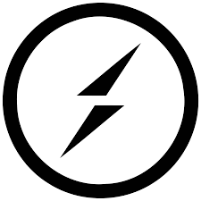

# **<h1 align="center">Hi, I'm Vineet Raj 👋</h1>**

Full-Stack Developer | Blockchain Enthusiast | Tech Innovator 💻🌍

Working to empower communities through technology. 🚀

[Explore My Work](#projects) | [Contact Me](#footer)

---

**<h1 align="center">About Me</h1>**

I am a passionate Full-Stack Developer with a strong foundation in blockchain technology, web development, and building innovative solutions. I'm always exploring new technologies and pushing the boundaries of what's possible. 💡

---

**<h1 align="center">Skills 💼</h1>**

| **Programming Languages**                                                           | **Web Development**                                                                                          | **DevOps & Tools**                                                              |
| ----------------------------------------------------------------------------------- | ------------------------------------------------------------------------------------------------------------ | ------------------------------------------------------------------------------- |
|               |                               |      |
|  |        |      |
|  |                       |  |
|          |                                     |            |
|                                                                                     |                                     |                                                                                 |
|                                                                                     |  |                                                                                 |
|                                                                                     |                                   |                                                                                 |
|                                                                                     |                                 |                                                                                 |
|                                                                                     |                                     |                                                                                 |

---

**<h1 align="center">Education 🎓</h1>**

## **Netaji Subhas University of Technology, Delhi** 🎓

- **Degree:** Bachelor of Technology
- **Major:** Computer Science and Engineering
- **Year:** 2022-2026
- **Coursework:**
  - DSA
  - Web Development
  - Software Engineering
  - Operating Systems
  - Compiler Design
  - Machine Learning

## **Govt. Boys Sr. Sec School No.1, Samalkha, New Delhi** 🏫

- **Degree:** Senior Secondary School
- **Major:** Science
- **Year:** 2019-2021
- **Coursework:**
  - Physics ⚛️
  - Chemistry 🔬
  - Mathematics 📐

---

**<h1 align="center">Projects 💡</h1>**

## **Blockchain Learning Platform** ⛓️

- **Tech Stack:** Next Js, MongoDB, Gemini, Typescript
- **Status:** In Progress 🛠️
- **Description:** A platform offering personalized learning paths, quizzes, and rewards using blockchain.
- **Source Code:** [GitHub](https://github.com/vineetraj/blockchain-learning)
- **Video:** [Watch Demo](https://www.youtube.com/embed/uy6LGbCQqwk?si=KSIVjvce3AoCD-dw?autoplay=1&mute=1&enablejsapi=1)

## **ATSai 🤖**

- **Tech Stack:** Next Js, MongoDB, Gemini
- **Status:** Completed ✅
- **Description:** AI-powered resume builder for job seekers to create ATS-friendly resumes using dynamic templates.
- **Source Code:** [GitHub](https://github.com/MrVineetRaj/ATSai-resume-builder)
- **Video:** [Watch Demo](https://www.youtube.com/embed/uy6LGbCQqwk?si=KSIVjvce3AoCD-dw)

## **Tracky App 📱**

- **Tech Stack:** React Native, MongoDB, Express Js, Node
- **Status:** Completed ✅
- **Description:** A React Native app to manage finances, nutritional intake, and habits, integrated with Aptos rewards.
- **Source Code:** [GitHub](https://github.com/MrVineetRaj/personal-tracker)
- **Video:** [Watch Demo](https://www.youtube.com/embed/uy6LGbCQqwk?si=KSIVjvce3AoCD-dw)

## **WritoCode 📝**

- **Tech Stack:** Next Js
- **Status:** Completed ✅
- **Description:** A blogging platform for developers to share their code snippets and articles.
- **Source Code:** [GitHub](https://github.com/MrVineetRaj/blogging-platform)
- **Video:** [Watch Demo](https://www.youtube.com/embed/uy6LGbCQqwk?si=KSIVjvce3AoCD-dw)

---

**<h1 align="center">Contact Me 📬</h1>**

    <a href="https://github.com/mrvineetraj">Github</a> | 
    <a href="https://www.linkedin.com/in/mrvineetraj">LinkedIn</a> |
    <a href="https://twitter.com/mrvineetraj">Twitter</a>

You can also reach out to me via email: <a href="mailto:vineetraj@example.com">Send Mail</a>

<a href="/resume.pdf" download>Download My Resume 📄</a>

